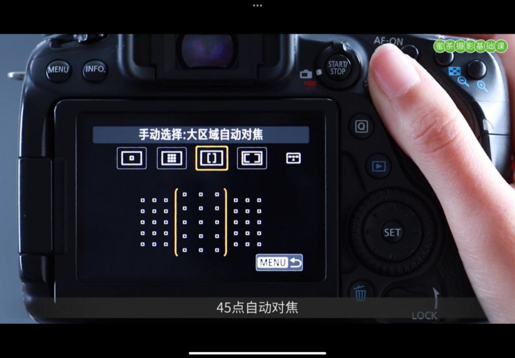
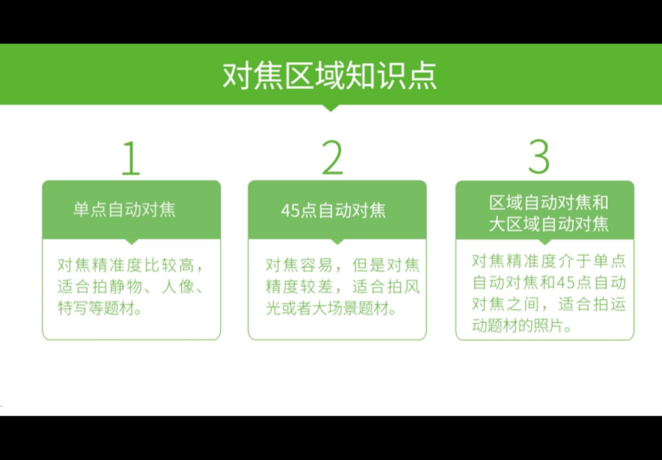
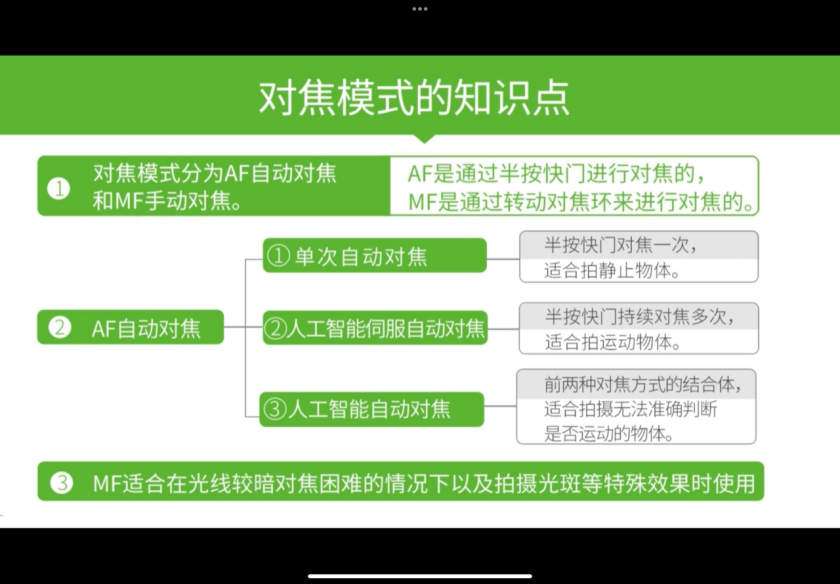
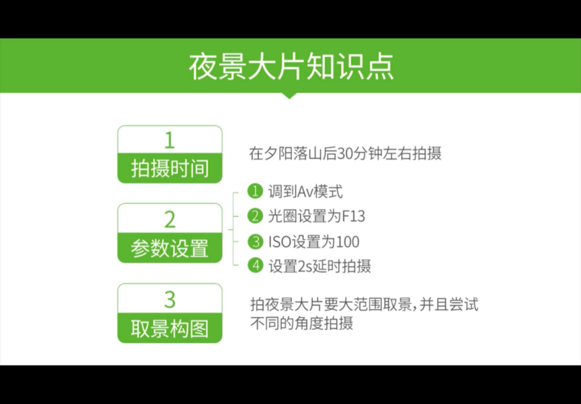
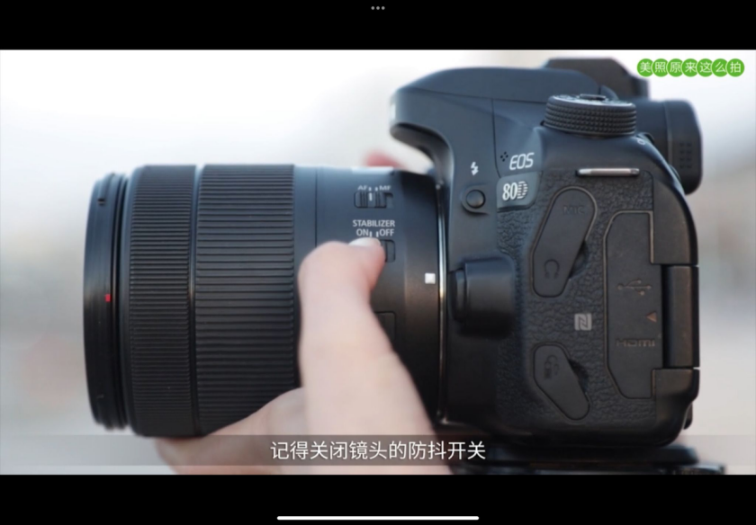
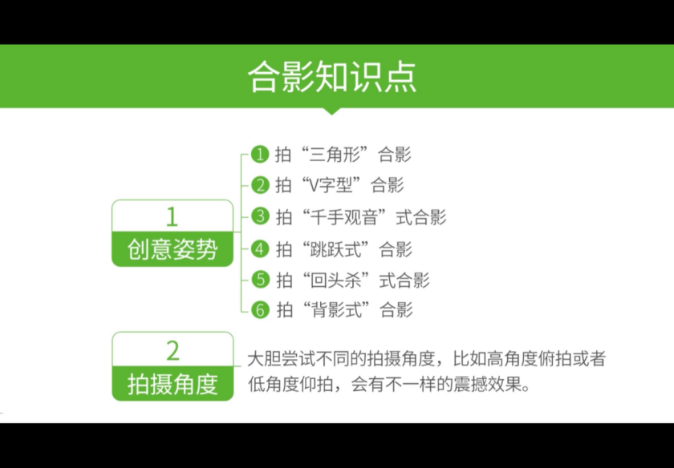
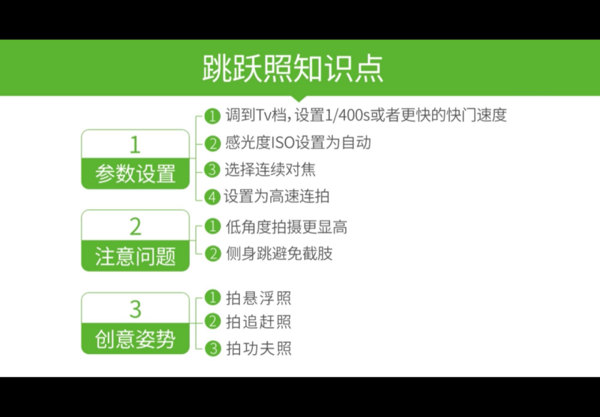
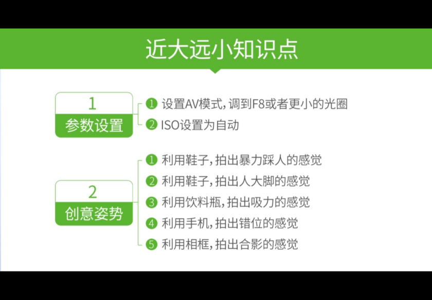
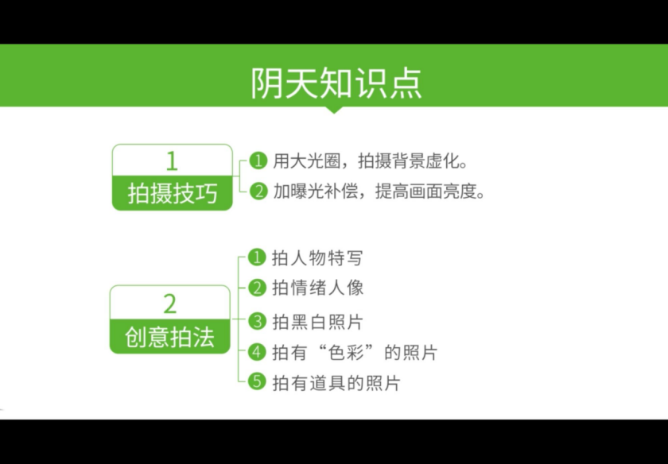
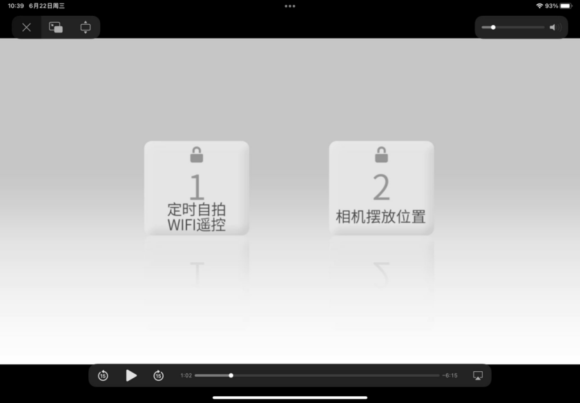

# **摄影基础知识**

 

##  明暗

1.曝光：原理，光线进去相机内的过程（照片明暗程度）；

​		影响因素（2.3.4）

2.光圈F：AV光圈优先原理，控制进光量。

​		表达，F+数字（与光圈大小成反比）。

​		作用，影响照片亮度，光圈越大照片越亮。

​		影响照片背景虚化 应用，（大光圈拍人物或特写，小光圈拍风景或合影）。设置。

3.快门M：TV快门优先原理，控制进光量。

​		表示，s为单位越大越慢。

​		作用，亮度：快门越快越暗，轨迹：定格或记录越快越清楚越慢轨迹越清楚。    

​		运用，高速快门拍运动宝宝动物，慢快门拍夜景动感。设置。

4.ISO：100到200，原理，感光元件对光线的敏感程度；ISO越高照片越亮。                 

​		表示，ISO+数字，数学越大ISO越高。               

​		作用，（噪点影响画质，ISO越大噪点越多）。                       

​		运用，白天或夜景三脚架低ISO；手持拍夜景或长焦段拍摄（高快门+高ISO）或运动物体。              			
​        设置，P,TV,AV,M模式按ISO键。

5.快门光圈和ISO的关系：关系， 配合。

 

 

1. 曝光模式：A*，自动调节。               

​			P，程序自动模式，ISO可手动设置。

​			TV，快门优先模式，快门ISO可手动调节。                       

​			AV，光圈优先模式，光圈ISO可手动调节。                        

​			M，全手动模式。                

​			SCN，场景模式➕全自动模式。

2. 测光模式：侦测周围环境光线。      

​			原理，相机对光线的检测。         

​			评价测光，分区测光。            

​			点测光，小区域测光（逆光人像，夕阳，剪影）

 

 

1. 曝光补偿：原理，控制画面亮度（M模式下曝光指示表，P.TV.AV模式下曝光补偿表）。

​			运用，白色物体加曝光补偿， 黑色物体减曝光补偿，明亮风格加曝光补偿，剪影风格减曝光补偿。 设置。

​        

##  清晰

什么是对焦：瞄准，半按快门，再按到底

对焦区域：分类，单点自动对焦，精准度最高，拍静止人物特写；

​		45点自动对焦AF，拍风光大场景的题材；

​		区域自动对焦，大区域自动对焦，拍运动物体。             

​		设置，顶端对焦按钮。

 

 

⑖ 

 

## 对焦模式

​		自动对焦AF，半按快门自动完成。                        

​		单次自动对焦，人像或静止物体。     

​		人工智能伺服自动对焦，运动物体 。人工智能自动对焦。               

​		手动对焦MF，粗的变焦环，细的对焦环。

​		放大键辅助。（光线昏暗，光斑） 设置，按AF主拨盘调节。

 

 

## 人像虚化

大（大光圈）长（长焦距）近（人物离镜头近）远（人物离背景远）。

光圈越大虚化越明显（与F后的数字成反比）。                         

（镜头上的数字，数字越大虚化越明显）。

 

 

## 夜景

拍摄时间，夕阳落山30分钟后。

参数设置，AV模式，F13 ，ISO100，延迟2s拍摄。

取景构图，大范围取景。

 

 

⑖ 

 

## 集体合照

 

 

## 跳跃照

 

 

## 错位照

 

 

 

## 阴天摄影

怎么拍：虚化背景（光圈最大）； 加曝光补偿

拍什么：人物特写

 

 

## 体现长腿

​	底角度拍摄

​	竖构图

​	不要头顶照片边缘，脚贴边缘

## 自拍

 

 