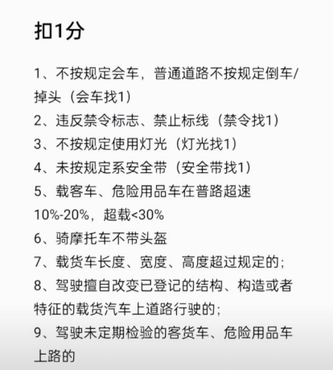
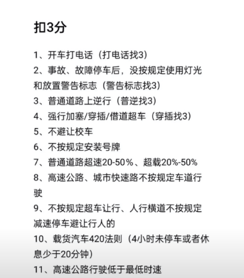
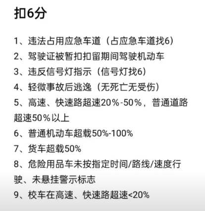
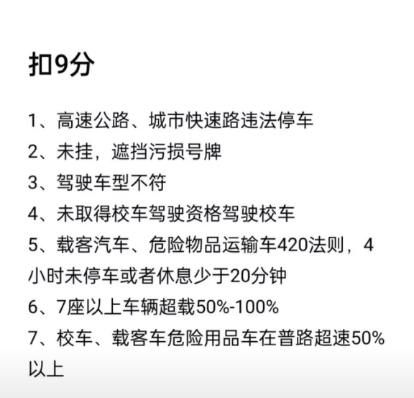
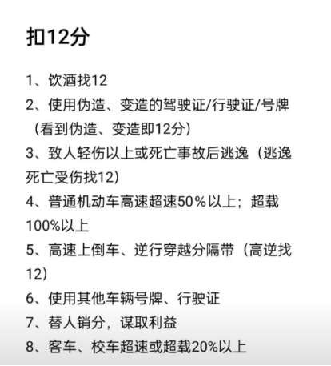

#            ***\*驾照\****

## 罚款

1、罚款20-200元：补证用旧证的、实习不挂标志的、信息变更不申报的；
2、罚款200元：开车打电话的、高速逆行的、实习自己上高速的、不挂或遮挡号牌的
3、罚款200-500元：驾驶证被依法扣押、扣留或者暂扣期间，以欺瞒手段补领驾驶证的；
4、罚款200-2000元：超速50%的、无证开车的、开有安全隐患的车、不听管不听劝的；
5、罚款1000-2000元：饮酒后驾驶机动车上路的；因酒后驾驶被处罚后，再次饮酒后驾驶机动车上路的；
6、罚款1000-3000元：伪造、变造或者使用伪造、变造的检验合格标志和保险标志；
7、罚款2000-5000元：伪造、变造或者使用伪造、变造的机动车登记证书、号牌、行驶证、驾驶证的。
																										——依据： 〈中华人民共和国道路交通安全法》

## 扣分

#### 1、扣12分

酒后运营、客超二零、事故逃逸、不符车型；

超速百分五十以上；

驾驶擅自改动结构、构造、特征的车辆；

伪造车牌，驾驶证，行驶证；

在高速或快车道通过中央分隔带倒车、逆行、掉头；

代替接受处罚和记分谋取利益；

#### 2、扣9分

高速违法停车；

超载百分之五十以上；

驾驶中型以上超4小时或休息未满20分钟；

不悬挂车牌或刻意遮挡车牌；

#### 3、扣6分

致人轻伤或财产损失后逃逸；

驾驶证被扣留或扣留期间驾车；

高速上占用应急车道；

货车超载；

校车或客运超载过百分之二十；

七座客车超载百分之二十以上百分之五十以下；

驾驶其他载客车超百分之五十以上；

#### 4、扣3分

不按规定安装车牌；

驾车超过4个小时为停车休息或停车休息少于20分钟；

借道超车或占用对面车道、穿插候等车辆；

超速百分三十以上百分五十以下；

拨打接听电话；

不按规定会车；

不按规定避让校车；

不按规定减速停车或避让行人；

驾驶未按规定检查安全技术的客运火运载危险品上路；

#### 5、扣1分

不带证照乱用灯，保险标志未放置；

会车不按规定行，载物超高和超重；

在高速公路快速路以外车道超速百分之十以上为达到百分之二十；

不按规定倒车，掉头；

不扣安全带；

机动车超过规定；

违反禁止标志或标线；
驾驶未按规定检查安全技术的客运火运载危险品以外车辆上路；

骑摩托不戴头盔；

​																				——依据《道路交通安全违法行为记分管理法》

## 考驾照科目一技巧口诀

1、题目里有“口“的选50米，有“站“的选30米，叫“口五站三“剩下的全选150米，没有150的选最大判断题全对。
						解析：车在<公交站/急救站/加油站/消防以、站、栓> (30米)以内，不得停车。
2、车在 距交叉路口/隧道口/陡坡/弯路/窄路：(50米)以内不得停车
有关公里的题目：城市街道选50公里，其余有30的全选30.、有“不得停车“的选择“不得停车“
3、危险知识：题目里找“不需要“ "不受””可以””三层””坚固无损”是错的，其余都是对的。
4、高速公路有关“不允许的行为“规定的选择题：选带“不准“、“不得“的答案；
5、判断题：只有“远心端“和“软质担架“是错的

## 科目一包过口诀

#### 【关于让行】

两车相遇谁先走?主要的考点，有这么几个：
右转让左转；下坡让上坡；进口让出口；
有障碍让无障碍；有条件让无条件；非公交让公交

#### 【关于车速】

在普通的道路上行驶，有这些口诀：
路中没有中心线，城内三十外四十；
同向一条机动道，城内五十外七十；
同向两多机动道，城内六十外八十；
遇到各种特殊路，一律三十以下过；
天气原因能见低，五十一百和二百，
对应三十四十和六十。

#### 【关于高速公路】

在高速公路上，各条车道还有不同的速度要求，这样来记忆：

高速行车跑多快，最高不超一百二，最低不能少六
同向只有两车道，左侧最低跑一百，右侧最低跑六
同向若有三车道，左侧不低一百一
中间不低于九十，右侧不低于六十；
同向若有四车道，要求参照三车道。

#### 【关于车距】

车后距离有一组数据，也可以按照口诀来记忆：
若发故障不能动，车尾远处设警告；
普通路上有停车，五十一百米之间；
高速路上有停车，最近也要一百五。
行车间距有要求，时速一百为界限；
低于一百距五十，高于一百距一百。
夜间会车改近光，相距至少一百五。

 

## 《机动车驾驶证申领和使用规定》

14. 城市公交车，中型客车，大型货车，轻型牵引车，无轨电车，有轨电车。20周岁以上，60周岁以下。大型客车，重型牵引挂车22周岁以上 ，60周岁以下。

93. 隐瞒情况或提供虚假材料谋取利益，处罚所得三倍以上五倍以下罚款最高不超过十万。

73. 申领递交材料：交通违法交通事故处理情况，身体条件，记分满12后学习情况

 

## 车型

B2大型货车，A1大型客车，A2重型牵引车，B1中型客车。

C6轻型牵引挂车，C1小型汽车，C2小型自动挡汽车，C4三轮汽车。

## 高速车速

两车道：10到12,6到10；

三车道：11到12,9到11,6到9；

 

## 交替使用近远光灯

急弯，坡路，拱桥，人行横道，没有交通信号灯的路口

## 禁止超车

前车在超车、掉头、左转弯

在隧道、铁路、交叉路口、人行横道、流通量大的路口、急弯、窄桥、陡坡

有会车，有抢险车

 

## 危险驾驶罪

1. 追逐竞驶，情节严重；

2. 醉酒驾车；

3. 严重超载或严重超速；

4. 违反危险化学品管理运输危险化学品危害公共安全；

 

## 《道路交通事故处理程序规定》

道路交通事故由发生地的县级公安机关交通管理部管辖；

在山区冰雪覆盖之地，在驱动轮上安装防滑链；

停车视距包括：反应距离，制动距离，安全距离；

未悬挂机动车牌，未放置检验合格标志，保险标志，未携带驾驶证·行驶证，应当扣留机动车；

机动车所有人更改名称或号码要提交身份证明，机动车登记书等

## 点火档位

LOCK：切断电源，锁定方向盘

ACC:接通附件电源

ON：接通除起动机以外的全车的全部电源

START：接通起动机电源，发动起动机

## 驾驶机动车前

1. 调整驾驶座椅，保证踩踏踏板舒适

2. 调整安全带的松紧与高低

3. 调整合适驾驶的方向盘位置

4. 安全枕头需要对准后脑勺来保护驾驶员的颈椎

5. 逆时针绕车一圈进行安全检查，对发动机舱和车辆外部主要零件进行检查

   

## 缩写

制动找B，电子找E，辅助找后A，自动找前A，警告找W

1. LDW（Lane Departure Warning）车道偏离预警系统

2. ACC（Adaptive Cruise Control）自适应巡航系统，制动锁定前车车速并变速

3. FCW（Forward Collision Warning）前方碰撞预警系统

4. ALC（Auto Lane Change)辅助驾驶系统

5. TMC（Traffic Messagge Channel）交通信息频道

6. BSD(Blind Spot Detection)盲区监测系统

7. TCS（Traction Control System）牵引力控制系统（ASR或TRC）

8. ESP(Electronic Stability Program)车辆车身稳定控制系统

9. EBS（Electronic Control Brake Assist）刹车辅助系统，电子控制制动辅助系统

10. AEB（Autonmous Emergency Braking）自动紧急制动系统

11. EBD（Electric Brakeforce Distribution）电子制动分派系统（在ABS的基础上发展）

12. CCS（Curise Control System）定速巡航系统

13. AFS（adaptive front-lighting system）自适应前灯系统

14. ABS反抱死制动系统

 

## 救援

失去知觉，放开放气道采取去枕仰卧位

成年人心肺按压频率每分钟100-120次，按压深度5-6厘米

救助全身燃烧伤员采取向身上喷冷水灭火最安全，可取未燃烧的衣服

脊柱骨折应原地待命，用三角巾固定相对安全

移动脊柱骨折的伤员不能用软担架，造成机械损伤

无骨外露时要预防二次伤害，固定要超过伤口上下关节

 

## 驾驶机动车接电话发生事故主要原因：

1. 单手握方向盘，控制力下降；

2. 注意力不集中，反应力下降；

3. 观察不到位，导致操作失误；

 

## 标线

双黄色虚线，潮汐车道线

白色折线，车距确定线

黄色填充标线，接近障碍物标线

黄黑相见的斜线，立体标记

黄色最高速度，白色最低速度，黑色建议速度

国家高速＋G数字，高速公路命名编号

快速公交，BRT车辆专用车道

三角形，减速让行

八角形，停车让行

有虚线，紧急停车带

无虚线，港湾车道或错车道

分离式车道

## 处刑

未逃逸3年以下

逃逸或情节严重3-7年

因逃逸致人死亡7年以上

## **科三**

调座位

灯光（前照灯，长照灯，长短交替×2，临时停车，关闭所有，左转向灯，手刹，）

上车

安全带

档位手刹

直线行驶（加速）

靠边停车（右转向灯）

。手刹，转头，安全带，下车，上车，安全带，手刹。

右转向灯，转头。

 

线路一

看到地上双箭头，打右转转向灯，摇头看，打一圈，变更车道，（转向灯不能掉）调（一圈半，右车道）头，超车，左转，一圈，

路线二

左转，左转，路口，歪到右边，变更车道，掉头一圈半，转弯，转弯一圈，

路线三

左转，（左转向灯不掉），工厂打转右向灯，（灯不掉）右转，超车，变更车道，掉头左车道